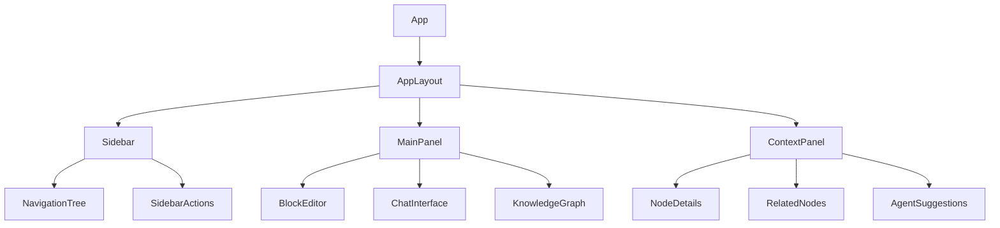
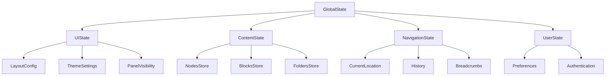
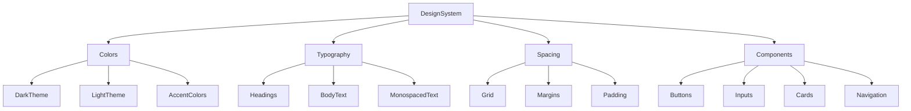

# AI-PKM Frontend Architecture Redesign Plan

After analyzing the current AI-PKM frontend architecture, I've developed a comprehensive redesign plan to transform the application to match Tana/Capacities style and functionality. This plan outlines the necessary changes to create a modern, flexible knowledge management system while maintaining compatibility with the existing backend API.

## Current Architecture Overview

The current frontend is a React application with TypeScript that uses:

- Zustand for state management
- React Router for navigation
- D3.js for knowledge graph visualization
- Basic CSS for styling
- Simple single-panel layouts for each page
- Separate Chat and Knowledge sections with limited integration

## Redesign Vision

The redesign will transform the application into a modern, multi-panel knowledge management system with:

- Dark-themed interface with clean, minimalist aesthetic
- Block-based editor for hierarchical content
- Flexible workspace that adapts to different use cases
- Integrated chat functionality within the knowledge management interface
- Improved visual styling matching Tana/Capacities design patterns

## 1. Component Structure Changes

### New Layout Architecture



### Core Components to Create

1. **AppLayout**: Flexible multi-panel container with resizable panels
   - Replaces current single-panel layout
   - Manages panel visibility and sizing
   - Supports different layout configurations

2. **Sidebar**: Navigation and organization panel
   - Hierarchical folder/page structure
   - Quick access to recent items
   - Tags and filters
   - Create new content buttons

3. **BlockEditor**: Hierarchical content editor
   - Supports nested blocks (paragraphs, lists, code, etc.)
   - Markdown-compatible
   - Supports references to other nodes
   - Inline formatting and commands

4. **NavigationTree**: Hierarchical content browser
   - Folder and page organization
   - Drag-and-drop reordering
   - Collapsible sections
   - Visual indicators for content types

5. **ContextPanel**: Contextual information display
   - Shows details about selected content
   - Displays related nodes
   - Shows agent suggestions
   - Provides contextual actions

### Components to Modify

1. **ChatWindow**: Integrate into the multi-panel layout
   - Redesign as a block-based conversation
   - Support for inline references to knowledge nodes
   - Visual styling to match the new design system

2. **KnowledgeGraph**: Update visualization style
   - Dark theme with vibrant node colors
   - Improved performance for large graphs
   - Better integration with block editor
   - Interactive node selection and navigation

3. **NodeDetail**: Transform into a block-based view
   - Replace form-based editing with block editor
   - Support for rich content types
   - Better visualization of relationships
   - Inline editing capabilities

## 2. New Components to Create

### Block Editor Components

1. **Block**: Base component for all content blocks
   - Handles selection, focus, and keyboard navigation
   - Supports drag and drop reordering
   - Manages block metadata

2. **BlockTypes**: Specialized block implementations
   - TextBlock: For paragraphs and basic text
   - ListBlock: For ordered and unordered lists
   - CodeBlock: For code snippets with syntax highlighting
   - QuoteBlock: For quotations
   - ReferenceBlock: For linking to other nodes
   - MediaBlock: For images, videos, and other media
   - TableBlock: For tabular data

3. **BlockCommands**: Command palette for block operations
   - Create new blocks
   - Transform block types
   - Apply formatting
   - Insert references

### Navigation Components

1. **FolderTree**: Hierarchical folder structure
   - Collapsible folders
   - Drag and drop organization
   - Context menus for actions

2. **PageList**: List of pages within a folder
   - Sorting and filtering options
   - Preview on hover
   - Quick actions

3. **TagBrowser**: Browse content by tags
   - Tag hierarchy visualization
   - Filter by multiple tags
   - Tag management

### Layout Components

1. **ResizablePanel**: Draggable, resizable panel
   - Remembers size preferences
   - Collapsible to icons-only mode
   - Responsive behavior

2. **TabContainer**: Tabbed interface for multiple content views
   - Open multiple pages/views simultaneously
   - Drag and drop tab reordering
   - Tab persistence across sessions

3. **CommandPalette**: Global command interface
   - Keyboard shortcut activation (Cmd/Ctrl+K)
   - Search across all content
   - Quick actions and navigation

## 3. State Management Approach

The current Zustand-based state management will be expanded to support the new features:



### State Stores to Create/Modify

1. **layoutStore**: Manage multi-panel layout configuration
   - Panel sizes and visibility
   - Current layout mode (focus, split, etc.)
   - Responsive layout adjustments

2. **blockEditorStore**: Manage block-based content
   - Block data and hierarchy
   - Selection and focus state
   - Undo/redo history
   - Block operations (create, update, delete)

3. **navigationStore**: Manage navigation state
   - Current location (folder/page)
   - Navigation history
   - Breadcrumb trail
   - Recent items

4. **folderStore**: Manage folder structure
   - Folder hierarchy
   - Page organization
   - Drag and drop operations
   - Folder metadata

5. **Enhance knowledgeStore**: Add support for
   - Hierarchical organization
   - Block-based content
   - References between nodes
   - Tags and metadata

6. **Enhance conversationStore**: Add support for
   - Integration with knowledge nodes
   - Block-based messages
   - References in conversations
   - Context-aware agent interactions

## 4. Routing Strategy

The routing system will be enhanced to support the new hierarchical structure:

```
/                           # Home/Dashboard
/folders/:folderId          # Folder view
/pages/:pageId              # Page view
/chat/:conversationId       # Chat view
/graph                      # Knowledge graph view
/search/:query              # Search results
/tags/:tagId                # Tag filtered view
```

### Routing Enhancements

1. **Nested Routes**: Support for hierarchical navigation
   - Folders can contain subfolders and pages
   - URL structure reflects hierarchy

2. **Query Parameters**: Support for view configuration
   - Panel visibility and sizes
   - View modes (edit, read, focus)
   - Filters and sorting options

3. **State Persistence**: Remember view state across navigation
   - Scroll position
   - Panel configuration
   - Selected blocks

4. **Deep Linking**: Direct links to specific content
   - Links to specific blocks within pages
   - Links to specific messages in conversations
   - Links to specific views of the knowledge graph

## 5. UI/UX Improvements

### Visual Design System



### Color Scheme

1. **Dark Theme Primary**:
   - Background: #1E1E2E (dark blue-gray)
   - Surface: #282838 (slightly lighter blue-gray)
   - Text: #E4E4E7 (off-white)

2. **Light Theme Alternative**:
   - Background: #F8F8FC (off-white)
   - Surface: #FFFFFF (white)
   - Text: #1E1E2E (dark blue-gray)

3. **Accent Colors**:
   - Primary: #7C3AED (vibrant purple)
   - Secondary: #10B981 (emerald green)
   - Tertiary: #3B82F6 (bright blue)
   - Warning: #F59E0B (amber)
   - Error: #EF4444 (red)

### Typography

1. **Font Family**:
   - Headings: Inter, system-ui, sans-serif
   - Body: Inter, system-ui, sans-serif
   - Monospaced: JetBrains Mono, monospace

2. **Font Sizes**:
   - xs: 0.75rem
   - sm: 0.875rem
   - md: 1rem
   - lg: 1.125rem
   - xl: 1.25rem
   - 2xl: 1.5rem
   - 3xl: 1.875rem
   - 4xl: 2.25rem

3. **Font Weights**:
   - Regular: 400
   - Medium: 500
   - Semibold: 600
   - Bold: 700

### Component Styling

1. **Cards and Panels**:
   - Subtle rounded corners (8px)
   - Light shadows in light mode
   - Subtle borders in dark mode
   - Consistent padding (16px)

2. **Buttons and Interactive Elements**:
   - Clear hover and active states
   - Consistent height and padding
   - Icon + text combinations
   - Subtle transitions (0.2s)

3. **Block Editor**:
   - Clear block boundaries
   - Visual indicators for block types
   - Consistent spacing between blocks
   - Subtle focus indicators

4. **Navigation Elements**:
   - Clear active state indicators
   - Consistent icon usage
   - Hierarchical indentation
   - Hover effects for interactive elements

## 6. Implementation Strategy

### Phase 1: Core Layout and Navigation

1. Create the new AppLayout component with resizable panels
2. Implement the Sidebar with basic navigation
3. Create the folder and page structure components
4. Implement the basic routing for the new structure
5. Create the theme system with dark/light modes

### Phase 2: Block Editor Implementation

1. Develop the core Block component architecture
2. Implement basic block types (text, list, etc.)
3. Create the block manipulation interface
4. Implement block serialization/deserialization
5. Connect the editor to the backend API

### Phase 3: Knowledge Integration

1. Enhance the KnowledgeGraph with new styling
2. Implement the ContextPanel for related content
3. Create the reference system between blocks
4. Implement tag-based organization
5. Develop the search and filter functionality

### Phase 4: Chat Integration

1. Redesign the ChatWindow to use the block editor
2. Implement the agent suggestion interface
3. Create the knowledge reference system in chat
4. Develop the context-aware agent interactions
5. Integrate chat with the knowledge graph

### Phase 5: Polish and Optimization

1. Refine animations and transitions
2. Optimize performance for large datasets
3. Implement keyboard shortcuts and accessibility
4. Create onboarding and help documentation
5. Conduct user testing and refinement

## 7. Technical Considerations

### State Persistence

1. **LocalStorage/IndexedDB**: For UI preferences and draft content
2. **Backend Sync**: For persistent storage of content
3. **Conflict Resolution**: For collaborative editing scenarios

### Performance Optimization

1. **Virtualized Lists**: For handling large collections of nodes/blocks
2. **Lazy Loading**: For loading content as needed
3. **Memoization**: For expensive calculations and renders
4. **Worker Threads**: For intensive operations like search and graph layout

### Accessibility

1. **Keyboard Navigation**: Full keyboard support for all operations
2. **Screen Reader Support**: ARIA attributes and semantic HTML
3. **Color Contrast**: Meeting WCAG AA standards
4. **Focus Management**: Clear focus indicators and logical tab order

### Mobile Responsiveness

1. **Adaptive Layout**: Panels stack on smaller screens
2. **Touch Interactions**: Support for touch gestures
3. **Simplified Views**: Focused views for mobile devices
4. **Performance Considerations**: Optimized rendering for mobile devices

## 8. Dependencies and Libraries

### Core Dependencies to Add

1. **@dnd-kit/core**: For drag and drop functionality
2. **@radix-ui/react-primitives**: For accessible UI components
3. **slate.js**: For the block editor implementation
4. **tailwindcss**: For utility-first styling
5. **@heroicons/react**: For consistent iconography
6. **react-resizable-panels**: For the multi-panel layout
7. **cmdk**: For command palette functionality
8. **date-fns**: For date manipulation and formatting

### Optional Enhancements

1. **react-spring**: For smooth animations
2. **react-virtualized**: For handling large lists
3. **localforage**: For improved client-side storage
4. **immer**: For simpler state updates
5. **react-hotkeys-hook**: For keyboard shortcut management

## Conclusion

This architectural plan provides a comprehensive roadmap for transforming the current AI-PKM frontend into a modern, flexible knowledge management system inspired by Tana and Capacities. The plan maintains compatibility with the existing backend API while introducing powerful new features like block-based editing, hierarchical organization, and improved visual styling.

The implementation strategy breaks down the work into manageable phases, allowing for incremental development and testing. The technical considerations address important aspects like performance, accessibility, and mobile responsiveness to ensure a high-quality user experience.
