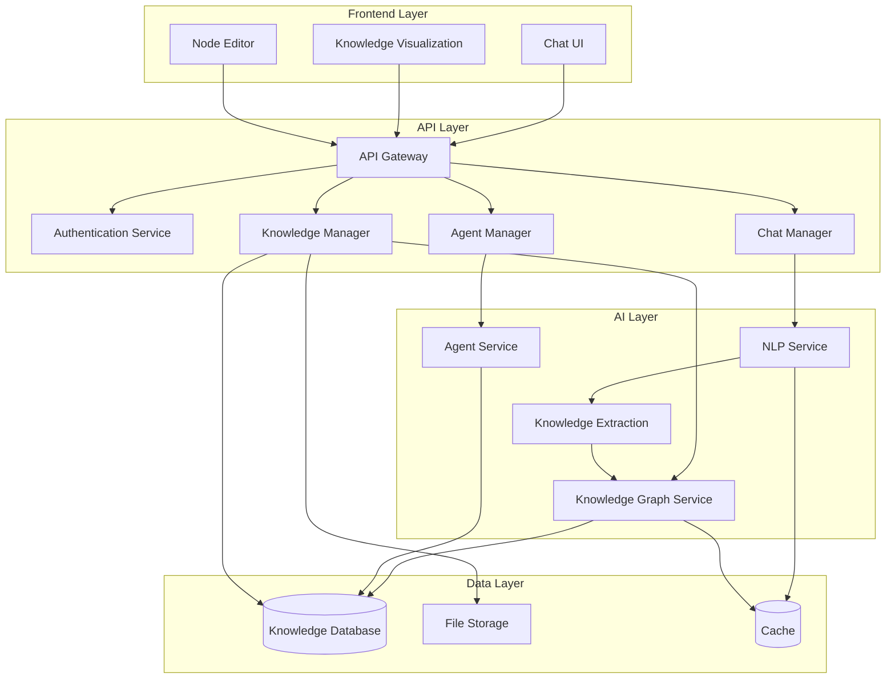
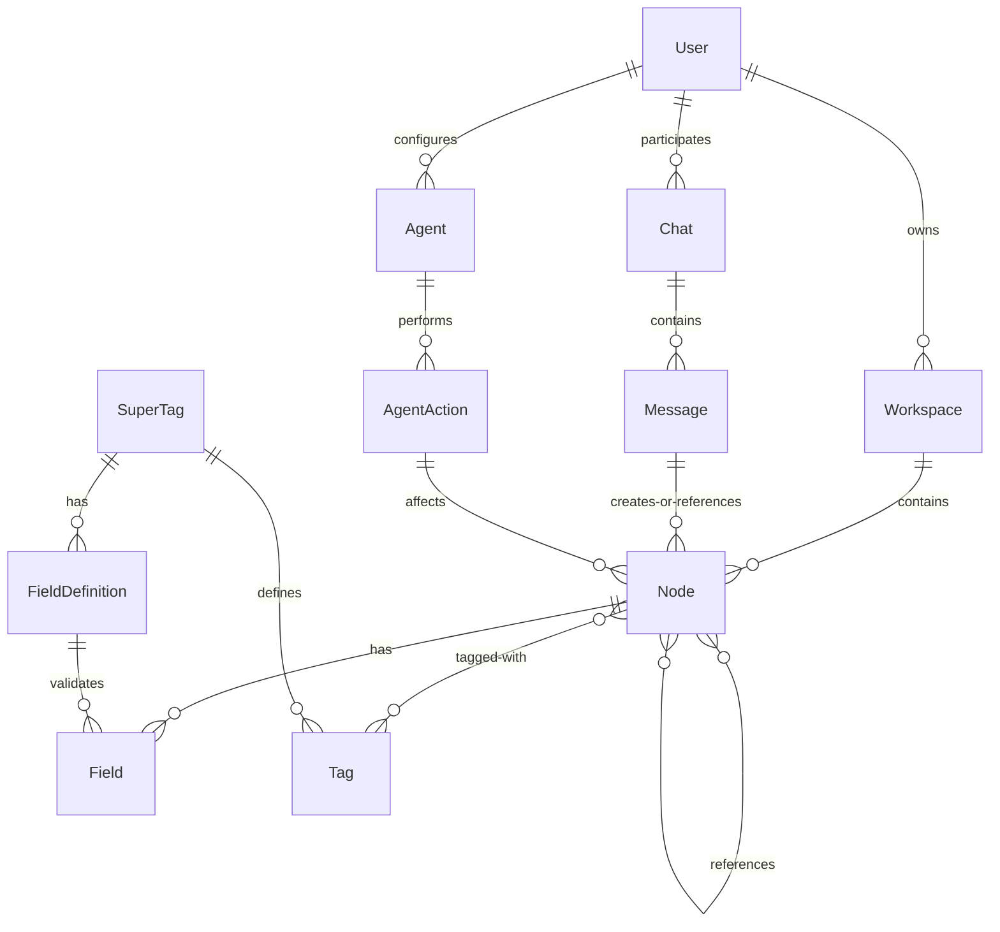
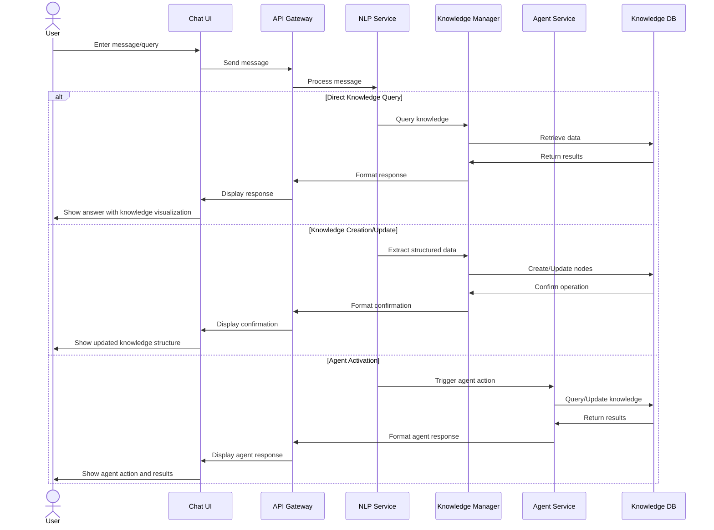
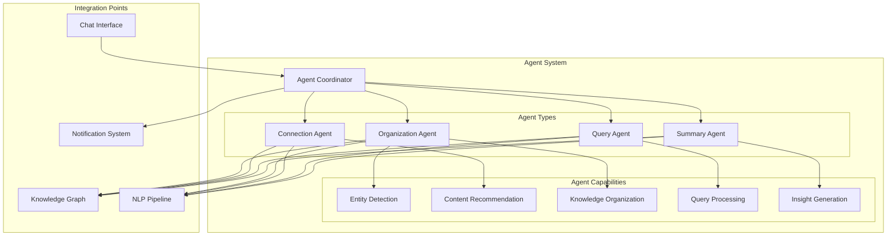
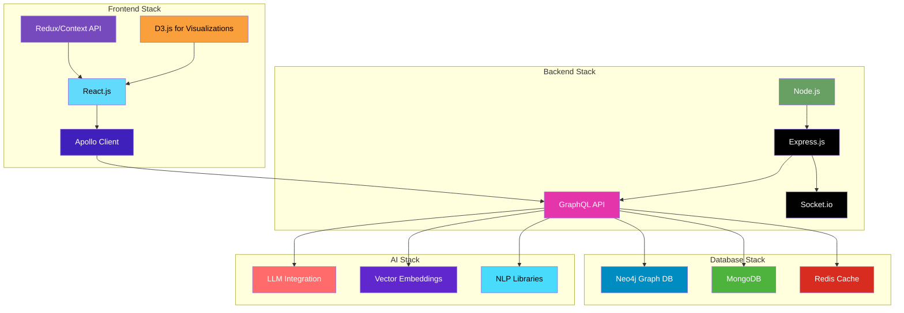
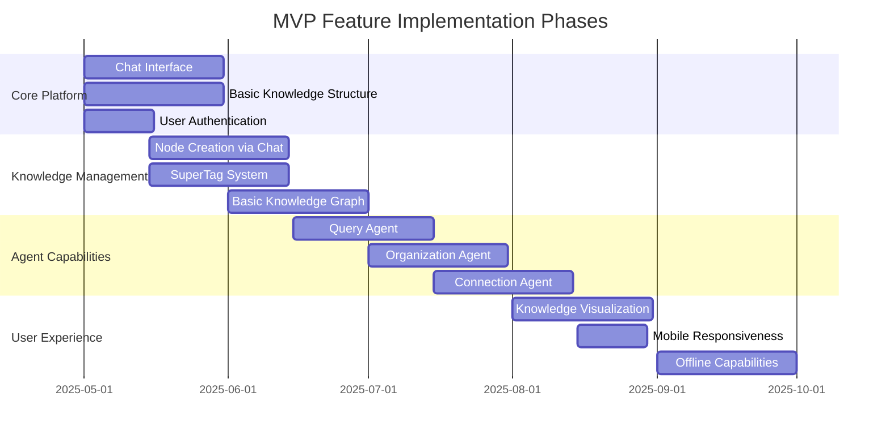

# AI-First Personal Knowledge Management (PKM) Architecture

This document outlines the comprehensive architecture for an AI-first Personal Knowledge Management (PKM) application with chat as the primary input method and agent capabilities.

## 1. Overall System Design with Key Components

The system is designed with a layered architecture to separate concerns and allow for scalability and maintainability.

### High-Level Architecture Diagram

### Key Components Description

#### Frontend Layer

- **Chat UI**: The primary interface for user interaction, allowing natural language input and conversation with the system.
- **Knowledge Visualization**: Displays the knowledge graph, relationships, and structured data in visual formats.
- **Node Editor**: Allows direct editing of nodes, supertags, and relationships when needed.

#### API Layer

- **API Gateway**: Central entry point for all client requests, handling routing and basic request processing.
- **Authentication Service**: Manages user authentication and authorization.
- **Chat Manager**: Handles chat sessions, message history, and conversation context.
- **Knowledge Manager**: Manages CRUD operations for knowledge entities.
- **Agent Manager**: Coordinates agent activities and requests.

#### AI Layer

- **NLP Service**: Processes natural language input, performs intent recognition, and semantic understanding.
- **Knowledge Extraction**: Extracts structured information from unstructured text.
- **Knowledge Graph Service**: Manages the knowledge graph, including entity relationships and inference.
- **Agent Service**: Implements agent behaviors, proactive suggestions, and autonomous actions.

#### Data Layer

- **Knowledge Database**: Stores structured knowledge, nodes, supertags, and relationships.
- **File Storage**: Stores attachments, images, and other binary data.
- **Cache**: Provides fast access to frequently used data and computation results.

## 2. Data Model for Storing and Organizing Knowledge

The data model is inspired by Tana's structured approach with nodes and supertags, optimized for chat-based interaction and agent capabilities.

### Entity Relationship Diagram

### Key Entities

#### Core Knowledge Structure

- **Node**: The fundamental unit of knowledge, can represent notes, tasks, concepts, etc.
  - Properties: id, title, content, createdAt, updatedAt, type, parentId
  
- **SuperTag**: Defines a schema for a type of node (similar to Tana's supertags)
  - Properties: id, name, description, icon, color
  
- **Tag**: Instance of a SuperTag applied to a node
  - Properties: id, superTagId, nodeId
  
- **Field**: Structured data attached to a node based on its SuperTag definition
  - Properties: id, nodeId, fieldDefinitionId, value, type
  
- **FieldDefinition**: Defines the schema for fields in a SuperTag
  - Properties: id, superTagId, name, type, required, defaultValue

#### Chat and Agent Structure

- **Chat**: Represents a conversation session
  - Properties: id, title, createdAt, updatedAt, workspaceId
  
- **Message**: Individual message in a chat
  - Properties: id, chatId, content, sender (user/system), timestamp, type
  
- **Agent**: Configurable agent that can perform actions on the knowledge base
  - Properties: id, name, description, configuration, active
  
- **AgentAction**: Record of actions performed by agents
  - Properties: id, agentId, type, description, timestamp, status

## 3. User Interaction Flow

The primary interaction flow emphasizes chat as the main input method.

### Sequence Diagram

### Key Interaction Patterns

1. **Chat-Based Knowledge Retrieval**:
   - User asks questions about their knowledge base
   - System interprets the query and retrieves relevant information
   - Results are presented conversationally with links to structured data

2. **Chat-Based Knowledge Creation**:
   - User inputs information in natural language
   - System extracts structured data and creates appropriate nodes
   - System applies relevant supertags based on content analysis
   - User confirms or refines the extracted structure through chat

3. **Agent-Assisted Organization**:
   - Agent proactively suggests connections between information
   - Agent identifies potential supertags for untagged content
   - Agent summarizes related information and presents insights
   - User can approve, modify, or reject agent suggestions through chat

4. **Hybrid Interaction Mode**:
   - Seamless transition between chat and direct manipulation
   - Chat results can be expanded into structured views
   - Structured views can be modified and then returned to chat context

## 4. Agent Functionality Requirements and Integration Points

The agent system is a core differentiator for this PKM application.

### Agent System Architecture

### Agent Types

1. **Organization Agent**:
   - Automatically categorizes and tags new information
   - Suggests restructuring of existing information
   - Identifies duplicate or redundant information
   - Integration points: Knowledge Graph, NLP Pipeline

2. **Connection Agent**:
   - Identifies relationships between seemingly unrelated pieces of information
   - Suggests links between nodes based on semantic similarity
   - Builds context maps for topics
   - Integration points: Knowledge Graph, NLP Pipeline

3. **Query Agent**:
   - Interprets natural language questions about the knowledge base
   - Retrieves relevant information across the knowledge graph
   - Synthesizes answers from multiple knowledge nodes
   - Integration points: Chat Interface, Knowledge Graph

4. **Summary Agent**:
   - Creates summaries of knowledge areas
   - Identifies key insights across the knowledge base
   - Generates reports on knowledge development over time
   - Integration points: Knowledge Graph, Notification System

### Agent Behaviors

1. **Reactive Behaviors** (triggered by user actions):
   - Answering direct questions
   - Processing requests for organization
   - Executing specific commands

2. **Proactive Behaviors** (autonomous):
   - Suggesting connections between recently added information
   - Periodic knowledge base maintenance and organization
   - Surfacing relevant information based on user context
   - Identifying knowledge gaps or areas for expansion

### Agent Integration Architecture

- **Event-Based Triggering**: Agents respond to system events (new content, queries, scheduled tasks)
- **Feedback Loop**: User feedback improves agent behavior over time
- **Configurable Autonomy**: Users can set how proactive each agent should be
- **Transparent Actions**: All agent actions are logged and can be reviewed/reversed

## 5. Technology Stack Recommendations

Based on the preference for React frontend and Node.js backend:

### Technology Stack Diagram

### Frontend Stack

- **Core Framework**: React.js with TypeScript
- **State Management**: Redux Toolkit or Context API with hooks
- **API Communication**: Apollo Client for GraphQL
- **UI Components**: Custom component library with accessibility focus
- **Visualization**: D3.js for knowledge graph visualization
- **Real-time Updates**: Socket.io client for live updates

### Backend Stack

- **Runtime**: Node.js with TypeScript
- **API Framework**: Express.js
- **API Architecture**: GraphQL with Apollo Server
- **Real-time Communication**: Socket.io
- **Authentication**: JWT with refresh token rotation
- **File Handling**: Multer for file uploads, Sharp for image processing

### Database Stack

- **Primary Database**: Neo4j (graph database for knowledge relationships)
- **Document Store**: MongoDB (for flexible document storage)
- **Caching Layer**: Redis (for performance optimization)
- **Search Engine**: Elasticsearch (for advanced text search capabilities)
- **Vector Database**: Pinecone or Milvus (for semantic search)

### AI Stack

- **LLM Integration**: OpenAI API (GPT-4) or self-hosted open-source LLM
- **Embedding Model**: Sentence-BERT or OpenAI Embeddings
- **NLP Processing**: spaCy or Hugging Face Transformers
- **Agent Framework**: LangChain or custom agent framework
- **Knowledge Extraction**: Custom NER with fine-tuned models

### DevOps & Infrastructure

- **Containerization**: Docker
- **Orchestration**: Kubernetes (for production) or Docker Compose (for development)
- **CI/CD**: GitHub Actions
- **Monitoring**: Prometheus and Grafana
- **Logging**: ELK Stack or Loki

## 6. Key Features for MVP

### MVP Implementation Phases

### Phase 1: Core Platform (MVP Foundation)

1. **Chat-Based Interface**:
   - Natural language input system
   - Basic response formatting
   - Conversation history

2. **Knowledge Structure Foundation**:
   - Node creation and editing
   - Basic tagging system
   - Parent-child relationships

3. **User Management**:
   - Authentication and authorization
   - User profiles
   - Basic workspace management

### Phase 2: Knowledge Management

4. **Chat-to-Knowledge Pipeline**:
   - Entity extraction from chat
   - Automatic node creation from conversations
   - Command syntax for explicit knowledge operations

5. **SuperTag System**:
   - SuperTag definition interface
   - Field types and validation
   - Tag application and management

6. **Knowledge Graph Basics**:
   - Relationship visualization
   - Basic navigation
   - Simple querying

### Phase 3: Agent Capabilities

7. **Query Agent Implementation**:
   - Natural language question answering
   - Context-aware responses
   - Knowledge retrieval and synthesis

8. **Organization Agent**:
   - Automatic tagging suggestions
   - Structure recommendations
   - Duplicate detection

9. **Connection Agent**:
   - Related content suggestions
   - Link recommendations
   - Semantic similarity detection

### Phase 4: Enhanced User Experience

10. **Advanced Knowledge Visualization**:
    - Interactive graph navigation
    - Multiple visualization modes
    - Custom views and filters

11. **Cross-Platform Experience**:
    - Mobile-responsive design
    - Progressive Web App capabilities
    - Sync across devices

12. **Offline Capabilities**:
    - Offline data access
    - Background synchronization
    - Conflict resolution

## Implementation Considerations

### Performance Optimization

- Implement efficient caching strategies for frequently accessed knowledge
- Use pagination and lazy loading for large knowledge bases
- Optimize graph queries with proper indexing and query planning

### Security Considerations

- End-to-end encryption for sensitive knowledge
- Fine-grained access control for shared workspaces
- Regular security audits and penetration testing

### Scalability Planning

- Horizontal scaling of stateless services
- Database sharding for large knowledge bases
- Microservice architecture for independent scaling of components

### Privacy Features

- Local-first processing where possible
- Transparent data usage policies
- Options for self-hosting or cloud deployment
